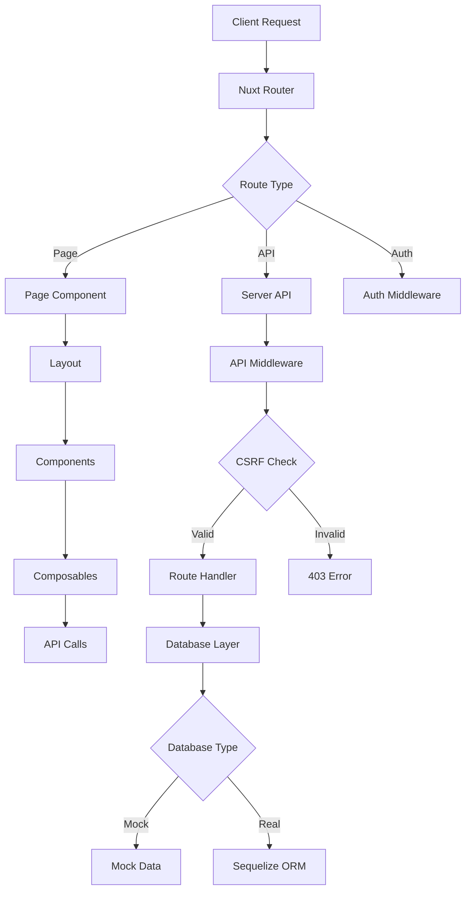
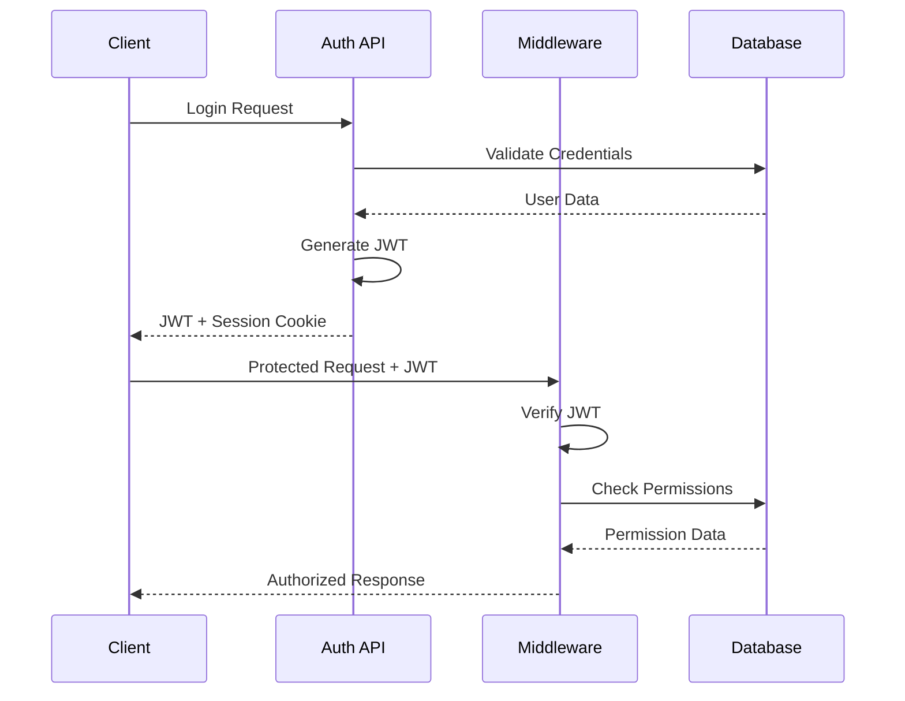

# SMI Corporation CMS - System Architecture

Complete technical architecture documentation for the SMI Corporation Content Management System.

## System Overview

SMI Corporation CMS is a modern, full-stack content management system built on Nuxt.js 3, designed for scalability, security, and maintainability. The system provides comprehensive user management, content creation, media handling, and administrative capabilities with enterprise-grade security features.

## Architecture Principles

### 🔒 Security-First Design
- CSRF protection with configurable token validation
- JWT-based authentication with secure cookie storage
- Role-based access control (RBAC) with granular permissions
- Input sanitization and validation at all layers
- XSS protection using DOMPurify
- Rate limiting on critical endpoints

### 🧩 Modular Architecture
- Component-based Vue.js frontend architecture
- API-first design with RESTful endpoints
- Separation of concerns across layers
- Plugin-based extensibility
- Reusable composables and utilities

### 🚀 Performance Optimization
- Server-side rendering (SSR) with Nuxt.js
- Image optimization with automatic variant generation
- Lazy loading and code splitting
- Caching strategies at multiple levels
- Database query optimization

### 🔧 Development Experience
- TypeScript support throughout the stack
- Hot module replacement for rapid development
- Comprehensive error handling and logging
- Mock database for development
- Automated testing capabilities

## Technology Stack

### Frontend Layer
```yaml
Core Framework: Nuxt.js 3.17.4
  - Vue.js 3.5.16 (Composition API)
  - Vue Router 4.5.1 (Automatic routing)
  - Pinia 3.0.2 (State management)

UI Framework: Nuxt UI 3.1.3
  - Tailwind CSS (Utility-first styling)
  - Headless UI components
  - Dark/Light mode support
  - Responsive design system

Rich Text Editing:
  - TipTap 2.14.0 (Prosemirror-based editor)
  - BBCode parsing and rendering
  - Custom editor extensions
  - Real-time preview capabilities

Media Handling:
  - FilePond 4.32.8 (File uploads)
  - Vue Advanced Cropper 2.8.9 (Image editing)
  - Sharp integration for processing
  - Drag-and-drop interfaces

Validation & Forms:
  - Vee-Validate 4.15.1 (Form validation)
  - Yup 1.6.1 (Schema validation)
  - Zod 3.25.67 (TypeScript-first validation)
```

### Backend Layer
```yaml
Server Runtime: Nitro (Nuxt Server Engine)
  - Universal rendering capabilities
  - API route handling
  - Middleware processing
  - Static asset serving

Database Layer:
  - Sequelize 6.37.7 (ORM)
  - MySQL2 3.14.1 (Production database)
  - SQLite3 5.1.7 (Development database)
  - Better-SQLite3 12.2.0 (Performance)

Authentication & Security:
  - JWT tokens with nuxt-auth-utils 0.5.20
  - bcryptjs 3.0.2 (Password hashing)
  - nuxt-csurf (CSRF protection)
  - DOMPurify 3.2.6 (XSS prevention)

Image Processing:
  - Sharp 0.34.2 (High-performance image processing)
  - File type validation
  - Automatic thumbnail generation
  - Format optimization
```

### Development Tools
```yaml
Language: TypeScript 5.8.3
Linting: ESLint 9.29.0 with Nuxt rules
Testing: Vitest 3.2.4 with @vitest/ui
Version Control: Git with Husky hooks
Package Manager: NPM with package-lock.json
```

## System Architecture Diagram

```
┌─────────────────────────────────────────────────────────────┐
│                    CLIENT BROWSER                           │
├─────────────────────────────────────────────────────────────┤
│  ┌─────────────┐  ┌─────────────┐  ┌─────────────┐        │
│  │   Pages     │  │ Components  │  │   Layouts   │        │
│  │ (/pages)    │  │ (/components)│ │ (/layouts)  │        │
│  └─────────────┘  └─────────────┘  └─────────────┘        │
│         │               │                 │               │
│  ┌─────────────────────────────────────────────────────────┤
│  │              NUXT.JS FRONTEND                          │
│  ├─────────────────────────────────────────────────────────┤
│  │  ┌─────────┐  ┌─────────┐  ┌─────────┐  ┌─────────┐   │
│  │  │ Stores  │  │Composab.│  │Plugins  │  │Middlew. │   │
│  │  │(Pinia)  │  │         │  │         │  │         │   │
│  │  └─────────┘  └─────────┘  └─────────┘  └─────────┘   │
│  └─────────────────────────────────────────────────────────┤
└─────────────────────────────────────────────────────────────┘
                              │ HTTP/API Calls
                              ▼
┌─────────────────────────────────────────────────────────────┐
│                    SERVER SIDE                              │
├─────────────────────────────────────────────────────────────┤
│  ┌─────────────────────────────────────────────────────────┤
│  │                 NITRO SERVER                           │
│  ├─────────────────────────────────────────────────────────┤
│  │  ┌─────────┐  ┌─────────┐  ┌─────────┐  ┌─────────┐   │
│  │  │API      │  │Middlew. │  │Services │  │Utils    │   │
│  │  │Routes   │  │         │  │         │  │         │   │
│  │  │(/api)   │  │(/server)│  │         │  │         │   │
│  │  └─────────┘  └─────────┘  └─────────┘  └─────────┘   │
│  └─────────────────────────────────────────────────────────┤
└─────────────────────────────────────────────────────────────┘
                              │ Database Operations
                              ▼
┌─────────────────────────────────────────────────────────────┐
│                   DATA LAYER                                │
├─────────────────────────────────────────────────────────────┤
│  ┌─────────────┐              ┌─────────────┐              │
│  │   MOCK DB   │              │  REAL DB    │              │
│  │             │     OR       │             │              │
│  │In-Memory    │              │MySQL/SQLite │              │
│  │Development  │              │Production   │              │
│  └─────────────┘              └─────────────┘              │
│         │                            │                     │
│  ┌─────────────────────────────────────────────────────────┤
│  │                SEQUELIZE ORM                           │
│  └─────────────────────────────────────────────────────────┤
└─────────────────────────────────────────────────────────────┘
                              │ File System
                              ▼
┌─────────────────────────────────────────────────────────────┐
│                  FILE STORAGE                               │
├─────────────────────────────────────────────────────────────┤
│  ┌─────────────┐  ┌─────────────┐  ┌─────────────┐        │
│  │   Images    │  │ Thumbnails  │  │   Public    │        │
│  │ (/images)   │  │ (Variants)  │  │ (/public)   │        │
│  └─────────────┘  └─────────────┘  └─────────────┘        │
└─────────────────────────────────────────────────────────────┘
```
- **Developer Experience**: Hot reloading, TypeScript support, comprehensive tooling
- **Scalability**: Designed for both development (mock data) and production environments

## 🎯 Core Technologies

### Frontend Stack
```yaml
Framework: Nuxt.js 3.17.4
  - Vue.js 3.5.16 (Composition API)
  - Server-side rendering + SPA mode
  - File-based routing
  - Auto-imports

UI Framework: "@nuxt/ui 3.1.3"
  - Tailwind CSS integration
  - Dark mode support
  - Responsive components
  - Accessibility features

State Management: Pinia 3.0.2
  - Composables-first approach
  - TypeScript support
  - Devtools integration

Content Editing:
  - TipTap 2.14.0 (Rich text editor)
  - Custom BBCode system
  - Real-time preview
  - Validation system
```

### Backend Stack
```yaml
Runtime: Nuxt Server API (Nitro)
  - Full-stack capabilities
  - API routes auto-generation
  - Middleware support
  - Edge deployment ready

Database: Sequelize 6.37.7
  - MySQL2 3.14.1 (Production)
  - SQLite3 5.1.7 (Development)
  - Mock database system
  - Migration support

Authentication: "nuxt-auth-utils 0.5.20"
  - JWT token management
  - Session handling
  - Role-based access control

Security:
  - bcryptjs 3.0.2 (Password hashing)
  - nuxt-csurf (CSRF protection)
  - DOMPurify 3.2.6 (XSS prevention)
  - Sharp 0.34.2 (Image processing)
```

## 📁 Project Structure

```
smi-corporation/
├── app/                          # Nuxt Application Layer
│   ├── components/               # Vue Components
│   │   ├── BBCodeEditor.vue      # Advanced BBCode editor
│   │   ├── BBCodeRenderer.vue    # Secure BBCode renderer
│   │   ├── images/               # Image management components
│   │   ├── pages/                # Page-specific components
│   │   └── ui/                   # Reusable UI components
│   │
│   ├── composables/              # Vue Composables
│   │   ├── useBBCode.js          # BBCode system logic
│   │   ├── useApi.js             # API calls with CSRF
│   │   └── useToast.js           # Notification system
│   │
│   ├── layouts/                  # Application Layouts
│   │   ├── default.vue           # Public layout
│   │   └── admin.vue             # Administration layout
│   │
│   ├── middleware/               # Route Middleware
│   │   ├── auth.js               # Authentication guard
│   │   └── pages.global.js       # Dynamic routing
│   │
│   ├── pages/                    # Application Pages
│   │   ├── admin/                # Administration interface
│   │   │   ├── index.vue         # Dashboard
│   │   │   ├── pages.vue         # Page management
│   │   │   ├── users.vue         # User management
│   │   │   └── images.vue        # Media management
│   │   ├── auth/                 # Authentication pages
│   │   └── [...slug].vue         # Dynamic page routing
│   │
│   ├── plugins/                  # Nuxt Plugins
│   └── stores/                   # Pinia Stores
│       └── auth.js               # Authentication state
│
├── server/                       # Backend Layer
│   ├── api/                      # API Endpoints
│   │   ├── auth/                 # Authentication API
│   │   ├── pages/                # Page management API
│   │   ├── users/                # User management API
│   │   ├── roles/                # Role management API
│   │   ├── permissions/          # Permission API
│   │   └── images/               # Media management API
│   │
│   ├── middleware/               # Server Middleware
│   │   └── api-middleware.js     # Request processing
│   │
│   ├── utils/                    # Server Utilities
│   │   ├── mock-db.js            # Mock database
│   │   ├── db-setup.js           # Database initialization
│   │   └── api-middleware.js     # API utilities
│   │
│   ├── models.js                 # Database Models
│   └── database.js               # Database Configuration
│
├── docs/                         # Documentation
├── public/                       # Static Assets
├── .env                          # Environment Variables
├── nuxt.config.ts                # Nuxt Configuration
└── package.json                  # Dependencies & Scripts
```

## 🔄 Data Flow Architecture

### Request Flow


### Authentication Flow


## 🎨 Component Architecture

### BBCode System
```yaml
useBBCode Composable:
  Purpose: Core BBCode logic and validation
  Features:
    - Custom tag definitions
    - Permission-based filtering
    - Real-time validation
    - Security sanitization
  
BBCodeEditor Component:
  Purpose: Advanced content editor
  Features:
    - Toolbar with tag buttons
    - Live preview mode
    - Contextual help system
    - Keyboard shortcuts
    - Error validation display
  
BBCodeRenderer Component:
  Purpose: Secure content rendering
  Features:
    - HTML sanitization
    - Dynamic component loading
    - API integration for dynamic content
    - Responsive layout adaptation
```

### Authentication System
```yaml
Auth Store (Pinia):
  State:
    - user: Current user object
    - isAuthenticated: Boolean status
    - permissions: User permissions array
  
  Actions:
    - login(): Authenticate user
    - logout(): Clear session
    - checkAuth(): Validate session
    - hasPermission(): Permission check
  
Auth Middleware:
  - Route protection
  - Permission validation
  - Redirect handling
  - Session management
```

## 🛡️ Security Architecture

### Multi-Layer Security
```yaml
Frontend Security:
  - Input validation (Vee-Validate + Yup/Zod)
  - XSS prevention (DOMPurify)
  - CSRF tokens in all forms
  - Secure cookie handling

Backend Security:
  - JWT token validation
  - bcrypt password hashing
  - SQL injection prevention (Sequelize)
  - Rate limiting middleware
  - Input sanitization

Database Security:
  - Parameterized queries
  - Role-based access control
  - Audit logging
  - Data encryption at rest
```

### BBCode Security
```yaml
Validation Levels:
  1. Syntax Validation: Proper BBCode structure
  2. Permission Check: User-allowed tags only
  3. Content Sanitization: XSS prevention
  4. Render Security: Safe HTML generation

Security Features:
  - Tag whitelist per user role
  - Attribute validation
  - Nested tag limit prevention
  - Output escaping
```

## 📊 Database Architecture

### Entity Relationship Model
```yaml
Core Entities:
  User:
    - id, name, email, password_hash
    - role_id (FK to Role)
    - created_at, updated_at
  
  Role:
    - id, name, description
    - created_at, updated_at
  
  Permission:
    - id, name, resource, action
    - description
  
  RolePermission:
    - role_id (FK), permission_id (FK)
    - granted_at
  
  Page:
    - id, title, slug, content, status
    - parent_id (self-referencing FK)
    - user_id (FK to User)
    - content_type (bbcode/html)
    - created_at, updated_at
  
  Image:
    - id, filename, url, alt_text
    - user_id (FK to User)
    - file_size, mime_type
    - created_at, updated_at
  
  AuditLog:
    - id, user_id, action, resource
    - old_values, new_values
    - ip_address, user_agent
    - created_at
```

### Mock vs Production Database
```yaml
Development (Mock):
  - In-memory data structures
  - Predefined test data
  - No external dependencies
  - Instant setup
  
Production:
  - MySQL/SQLite database
  - Sequelize ORM migrations
  - Connection pooling
  - Backup and recovery
```

## 🔌 API Architecture

### RESTful Endpoints
```yaml
Authentication:
  POST /api/auth/login      # User login
  POST /api/auth/logout     # User logout
  POST /api/auth/register   # User registration
  GET  /api/_auth/session   # Session validation

Content Management:
  GET    /api/pages         # List all pages
  POST   /api/pages         # Create new page
  GET    /api/pages/:id     # Get specific page
  PUT    /api/pages/:id     # Update page
  DELETE /api/pages/:id     # Delete page
  GET    /api/pages/tree    # Get page hierarchy

User Management:
  GET    /api/users         # List users
  POST   /api/users         # Create user
  PUT    /api/users/:id     # Update user
  DELETE /api/users/:id     # Delete user

Media Management:
  GET    /api/images        # List images
  POST   /api/images        # Upload image
  PUT    /api/images/:id    # Update image
  DELETE /api/images/:id    # Delete image

System:
  GET    /api/roles         # List roles
  GET    /api/permissions   # List permissions
```

### API Response Format
```typescript
// Success Response
{
  success: true,
  data: any,
  message?: string,
  meta?: {
    pagination?: PaginationInfo,
    timestamp: string
  }
}

// Error Response
{
  success: false,
  error: {
    code: string,
    message: string,
    details?: any
  },
  timestamp: string
}
```

## 🚀 Deployment Architecture

### Development Environment
```yaml
Local Development:
  - npm run dev (Hot reload)
  - Mock database mode
  - Debug logging enabled
  - CSRF protection optional
  
Environment Variables:
  - USE_MOCK_DB=true
  - NODE_ENV=development
  - NUXT_DEBUG=true
```

### Production Environment
```yaml
Production Build:
  - npm run build (Static generation)
  - Real database connection
  - CSRF protection enforced
  - Logging and monitoring
  
Environment Variables:
  - USE_MOCK_DB=false
  - DATABASE_URL=mysql://...
  - JWT_SECRET=...
  - CSRF_SECRET=...
```

## 📈 Performance Considerations

### Frontend Optimization
```yaml
Code Splitting:
  - Route-based splitting
  - Component lazy loading
  - Dynamic imports
  
Caching Strategy:
  - Static asset caching
  - API response caching
  - Component memoization
  
Image Optimization:
  - Sharp processing
  - Lazy loading
  - Responsive images
```

### Backend Optimization
```yaml
Database:
  - Query optimization
  - Connection pooling
  - Index strategies
  
API Performance:
  - Response compression
  - Rate limiting
  - Caching headers
```

## 🔧 Configuration Management

### Nuxt Configuration
```typescript
// nuxt.config.ts
export default defineNuxtConfig({
  // Core modules
  modules: [
    '@nuxt/ui',
    '@pinia/nuxt',
    'nuxt-auth-utils',
    'nuxt-csurf'
  ],
  
  // Security configuration
  csurf: {
    https: false, // Development
    cookieKey: '__Host-csrf',
    methodsToProtect: ['POST', 'PUT', 'PATCH', 'DELETE']
  },
  
  // Runtime configuration
  runtimeConfig: {
    // Server-side only
    databaseUrl: process.env.DATABASE_URL,
    jwtSecret: process.env.JWT_SECRET,
    
    // Public configuration
    public: {
      useMockDb: process.env.USE_MOCK_DB === 'true'
    }
  }
})
```

## 🎯 Extension Points

### Adding New BBCode Tags
```javascript
// In useBBCode.js
customBBCodes: {
  newTag: {
    tag: 'newtag',
    description: 'Description of new tag',
    syntax: '[newtag param="value"]content[/newtag]',
    component: 'NewTagComponent'
  }
}

// In BBCodeRenderer.vue
newTag: {
  type: 'tag',
  open: (attr) => `<div class="new-tag" data-param="${attr.param}">`,
  close: '</div>'
}
```

### Adding New API Endpoints
```javascript
// server/api/newresource/index.get.js
export default defineEventHandler(async (event) => {
  // Implement endpoint logic
  return { data: result }
})
```

This architecture provides a solid foundation for a scalable, secure, and maintainable CMS with advanced content editing capabilities.