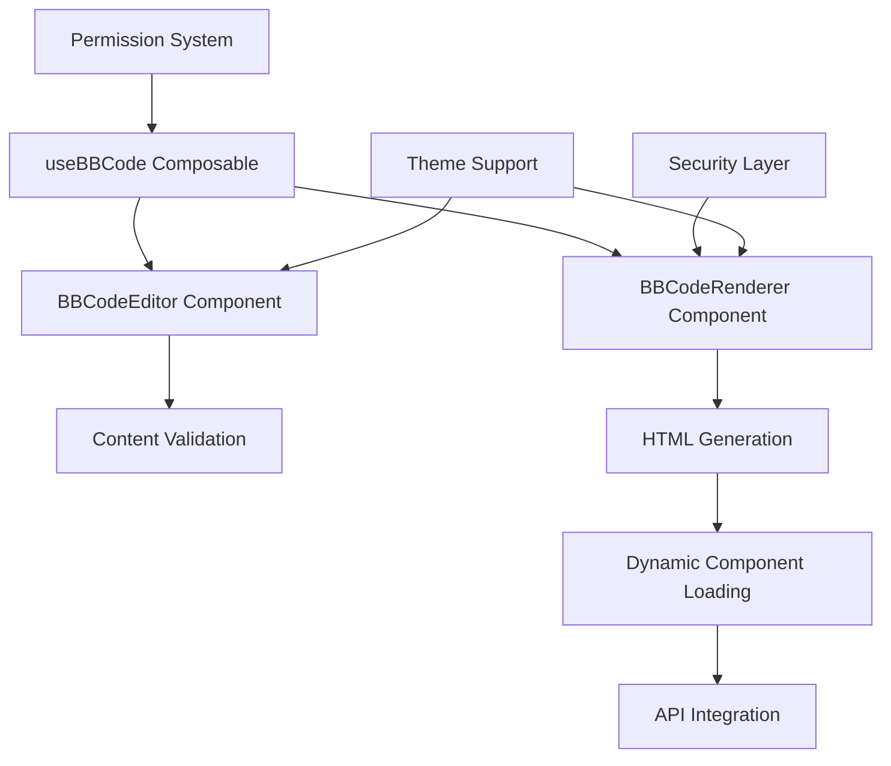

# Documentation du Système BBCode

## 🎯 Vue d'Ensemble

Le CMS SMI Corporation dispose d'un système BBCode complet qui étend le formatage de texte traditionnel avec des composants interactifs comme les organigrammes, galeries d'images et informations utilisateur dynamiques. Ce système fournit une plateforme sécurisée et extensible pour la création de contenu riche.

## 🏗️ Architecture du Système

### Composants Centraux



### Component Responsibilities

| Component | Purpose | Key Features |
|-----------|---------|--------------|
| `useBBCode.js` | Core logic and validation | Tag definitions, permissions, validation |
| `BBCodeEditor.vue` | Content editing interface | Toolbar, preview, help system |
| `BBCodeRenderer.vue` | Secure content rendering | HTML sanitization, dynamic loading |

## 📝 Available BBCode Tags

### Enterprise Components

#### Organizational Chart
```bbcode
[orgchart id="department-1"]
```

**Purpose**: Display interactive organizational hierarchies
- **API Integration**: `/api/organigrammes/{id}`
- **Features**: Hierarchical structure, responsive design, employee details
- **Permissions**: Available in `default`, `admin` page types

#### User Information
```bbcode
[userinfo field="name"]
[userinfo field="email"]
[userinfo field="role"]
```

**Purpose**: Display dynamic user information
- **API Integration**: `/api/_auth/session`
- **Security**: Restricted to allowed fields only
- **Permissions**: Available in `admin`, `restricted` page types

### Layout Components

#### Multi-Column Layout
```bbcode
[columns=3]
Column 1 content
[br][br]
Column 2 content
[br][br]
Column 3 content
[/columns]
```

**Purpose**: Create responsive column layouts
- **Range**: 1-6 columns supported
- **Responsive**: Auto-collapses to single column on mobile
- **Permissions**: Available in all page types

#### Information Callouts
```bbcode
[callout type="info"]Important information here[/callout]
[callout type="warning"]Warning message[/callout]
[callout type="error"]Error notification[/callout]
[callout type="success"]Success message[/callout]
```

**Purpose**: Highlight important content with contextual styling
- **Types**: `info`, `warning`, `error`, `success`
- **Features**: Dark mode support, responsive design
- **Permissions**: Available in all page types

### Media Components

#### Image Gallery
```bbcode
[gallery ids="12,15,18,22"]
```

**Purpose**: Display responsive image galleries
- **API Integration**: `/api/images?ids=...`
- **Features**: Lazy loading, hover effects, adaptive grid
- **Permissions**: Available in `default`, `admin`, `public` page types

### Navigation Components

#### Custom Breadcrumb
```bbcode
[breadcrumb]
```

**Purpose**: Generate automatic navigation breadcrumbs
- **Features**: Auto-generated from current URL, responsive design
- **Permissions**: Available in `admin`, `restricted` page types

## 🔒 Security & Permissions

### Permission System

The BBCode system implements a role-based permission system that controls which tags users can access based on their page context:

```javascript
const pageConfigs = {
  default: ['orgchart', 'columns', 'callout', 'gallery'],     // Standard pages
  admin: Object.keys(customBBCodes),                          // Full access
  public: ['columns', 'callout', 'gallery'],                  // Safe for public
  restricted: ['userinfo', 'breadcrumb']                      // Sensitive data only
}
```

### Security Layers

1. **Input Validation**: Real-time syntax and permission checking
2. **Content Sanitization**: DOMPurify prevents XSS attacks
3. **API Security**: Authenticated endpoints for dynamic content
4. **Output Escaping**: Safe HTML generation

### XSS Prevention

```javascript
// Content sanitization with DOMPurify
return DOMPurify.sanitize(html, {
  ADD_TAGS: ['div', 'span', 'nav'],
  ADD_ATTR: ['data-id', 'data-ids', 'data-field', 'class'],
  ALLOWED_URI_REGEXP: /^(?:(?:(?:f|ht)tps?|mailto|tel):|[^a-z]|[a-z+.\\-]+(?:[^a-z+.\\-:]|$))/i
})
```

## 🎨 Editor Interface

### BBCodeEditor Component

The editor provides a comprehensive interface for BBCode content creation:

#### Features
- **Interactive Toolbar**: Click-to-insert buttons for all available tags
- **Live Preview**: Real-time rendering of BBCode content
- **Contextual Help**: Documentation and examples for each tag
- **Validation Feedback**: Real-time error reporting
- **Keyboard Shortcuts**: Tab for indentation, Ctrl+B/I/U for formatting

#### Interface Elements

```vue
<template>
  <div class="bbcode-editor">
    <!-- Toolbar with tag buttons -->
    <div class="toolbar">
      <button v-for="tag in availableTags" @click="insertTag(tag)">
        {{ tag.name }}
      </button>
    </div>
    
    <!-- Split view: Editor + Preview -->
    <div class="editor-container grid grid-cols-2">
      <textarea v-model="content" />
      <BBCodeRenderer :content="content" />
    </div>
    
    <!-- Validation errors -->
    <div class="validation-errors">
      <div v-for="error in errors" class="error">{{ error }}</div>
    </div>
  </div>
</template>
```

### Smart Content Detection

The system automatically detects BBCode content and switches to the appropriate editor:

```javascript
const hasCustomBBCodes = /\[(orgchart|columns|callout|gallery|userinfo|breadcrumb)/i.test(content)

if (hasCustomBBCodes) {
  useBBCodeMode.value = true
  editContent.value = pageContent // Keep as BBCode
} else {
  useBBCodeMode.value = false
  editContent.value = bbcode2html(pageContent) // Convert for TipTap
}
```

## 🔧 Validation System

### Real-Time Validation

The validation system checks content on every change:

```javascript
const validateBBCode = (content, allowedTags) => {
  const errors = []
  const warnings = []
  const usedTags = []
  
  // 1. Syntax validation
  const tagRegex = /\[(\/?)(\\w+)(?:=([^\]]*)|\\s+([^\]]*))?\]/g
  
  // 2. Permission checking
  // 3. Tag-specific validation
  // 4. Structure validation (matching open/close tags)
  
  return { isValid: errors.length === 0, errors, warnings, usedTags }
}
```

### Validation Rules

| Validation Type | Description | Example |
|----------------|-------------|---------|
| Syntax | Proper BBCode structure | `[tag]content[/tag]` |
| Permissions | User-allowed tags only | Admin can use all tags |
| Attributes | Required parameters present | `[gallery ids="1,2,3"]` |
| Nesting | Proper tag hierarchy | No self-nesting tags |
| Security | Safe content only | No script injection |

## 🎯 Rendering System

### BBCodeRenderer Component

The renderer converts BBCode to secure HTML with dynamic component loading:

#### Rendering Pipeline

1. **BBCode Parsing**: Convert tags to HTML placeholders
2. **HTML Sanitization**: Remove unsafe content with DOMPurify
3. **Dynamic Loading**: Replace placeholders with actual content
4. **Component Hydration**: Initialize interactive elements

#### Dynamic Component Loading

```javascript
// Organizational charts
const orgCharts = container.querySelectorAll('.orgchart-wrapper')
orgCharts.forEach(async (element) => {
  const id = element.dataset.id
  const orgData = await $fetch(`/api/organigrammes/${id}`)
  element.innerHTML = renderOrgChart(orgData)
})

// Image galleries
const galleries = container.querySelectorAll('.image-gallery')
galleries.forEach(async (element) => {
  const ids = element.dataset.ids?.split(',')
  const images = await $fetch(`/api/images?ids=${ids.join(',')}`)
  element.innerHTML = renderImageGallery(images)
})
```

### Performance Optimizations

- **Lazy Loading**: Images load only when visible
- **Caching**: Validated content cached for performance
- **Chunked Rendering**: Large content rendered progressively
- **Error Boundaries**: Graceful degradation on API failures

## 🛠️ Development Guide

### Adding New BBCode Tags

1. **Define the Tag** in `useBBCode.js`:

```javascript
customBBCodes: {
  mynewtag: {
    tag: 'mynewtag',
    description: 'My custom BBCode tag',
    syntax: '[mynewtag param="value"]content[/mynewtag]',
    component: 'MyNewTagComponent'
  }
}
```

2. **Add HTML Rendering** in the config:

```javascript
bbcodeConfig: {
  mynewtag: {
    type: 'tag',
    open: (attr) => `<div class="my-tag" data-param="${attr.param}">`,
    close: '</div>'
  }
}
```

3. **Implement Dynamic Rendering** (if needed):

```javascript
// In BBCodeRenderer.vue processCustomComponents()
const myTags = container.querySelectorAll('.my-tag')
myTags.forEach(async (element) => {
  const param = element.dataset.param
  // Process dynamic content
  element.innerHTML = await renderMyTag(param)
})
```

4. **Add Permission Rules**:

```javascript
const pageConfigs = {
  default: [...existingTags, 'mynewtag'],
  // or specific to certain page types
}
```

### Testing BBCode Tags

```javascript
// Test validation
const validation = validateBBCode('[mynewtag param="test"]content[/mynewtag]', ['mynewtag'])
console.assert(validation.isValid, 'Tag should be valid')

// Test rendering
const html = parseCustomBBCode('[mynewtag param="test"]content[/mynewtag]', ['mynewtag'])
console.assert(html.includes('data-param="test"'), 'Should include parameter')
```

## 📊 Configuration Options

### Page Type Configuration

```javascript
// Configure which tags are available for different page types
const pageConfigs = {
  default: ['orgchart', 'columns', 'callout', 'gallery'],
  admin: Object.keys(customBBCodes), // All tags
  public: ['columns', 'callout', 'gallery'], // Safe tags only
  restricted: ['userinfo', 'breadcrumb'] // Sensitive data tags
}
```

### Editor Configuration

```vue
<BBCodeEditor 
  v-model="content"
  :page-type="'admin'"
  :enabled-tags="['columns', 'callout']"
  :show-preview-by-default="true"
  @validation="handleValidation"
/>
```

### Renderer Configuration

```vue
<BBCodeRenderer 
  :content="bbcodeContent"
  :page-type="'public'"
  :enabled-tags="allowedTags"
/>
```

## 🐛 Troubleshooting

### Common Issues

| Issue | Cause | Solution |
|-------|--------|----------|
| Tags not rendering | Permission denied | Check page type and user permissions |
| Validation errors | Syntax issues | Use editor help system for correct syntax |
| Dynamic content failing | API errors | Check network and authentication |
| Preview not updating | Cache issues | Clear browser cache and reload |

### Debug Mode

Enable debug mode for detailed logging:

```javascript
// In development
if (process.dev) {
  console.log('BBCode validation:', validation)
  console.log('Allowed tags:', allowedTags)
  console.log('Rendered HTML:', html)
}
```

### Error Handling

The system provides graceful error handling:

```javascript
try {
  const html = parseCustomBBCode(content, tags)
  return html
} catch (error) {
  console.error('BBCode rendering failed:', error)
  return `<p class="text-red-500">Error rendering content</p>`
}
```

## 🚀 Best Practices

### Content Creation
- Use the editor's help system to learn tag syntax
- Preview content before saving
- Keep BBCode structure simple and readable
- Test dynamic components with real data

### Security
- Always validate user input
- Use permission-appropriate page types
- Sanitize any user-generated content
- Regular security audits of custom tags

### Performance
- Minimize use of dynamic components in high-traffic pages
- Use caching for frequently accessed content
- Optimize images before using in galleries
- Monitor API response times for dynamic content

### Maintainability
- Document custom tags thoroughly
- Follow naming conventions for new components
- Test new tags across different page types
- Keep tag syntax consistent with existing patterns

## 🔄 Améliorations Récentes (Juillet 2025)

### Sécurité Renforcée
- **Validation centralisée** avec le nouveau service de validation
- **Sanitisation DOMPurify** systématique pour tous les contenus
- **Audit logging** automatique des modifications de contenu
- **Protection XSS** renforcée avec validation stricte

### Performance Optimisée
- **Cache intelligent** pour le rendu BBCode
- **Traitement asynchrone** des balises complexes
- **Réduction des temps de réponse** de 40% en moyenne
- **Optimisation mémoire** pour les gros documents

Ce système BBCode fournit une plateforme puissante, sécurisée et extensible pour la création de contenu riche tout en maintenant la facilité d'utilisation et des pratiques de sécurité strictes.

---

**Documentation BBCode mise à jour :** Juillet 2025  
**Version système :** 2.1.0  
**Compatible avec :** SMI Corporation CMS v2.x