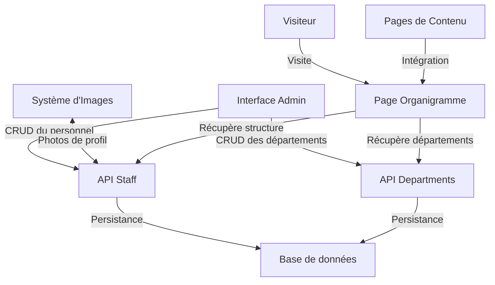

# Plan d'implémentation d'un système de gestion d'organigramme

Ce document détaille le plan de mise en œuvre d'un système de gestion d'organigramme avec photos du personnel pour l'application SMI Corporation.

## 1. Modèle de données

### 1.1 Création d'un modèle `StaffMember`

```javascript
StaffMember = {
  id: Integer,                // Identifiant unique
  firstName: String,          // Prénom
  lastName: String,           // Nom de famille
  position: String,           // Poste/Fonction
  department: String,         // Département/Service
  email: String,              // Email professionnel
  phone: String,              // Téléphone (optionnel)
  biography: Text,            // Biographie courte (optionnel)
  imageId: Integer,           // Référence à l'image de profil (optionnel)
  managerId: Integer,         // Référence au supérieur hiérarchique (optionnel)
  order: Integer,             // Ordre d'affichage parmi les membres du même niveau
  isVisible: Boolean,         // Visibilité dans l'organigramme public
  createdAt: DateTime,        // Date de création
  updatedAt: DateTime         // Date de dernière modification
}
```

### 1.2 Création d'un modèle `Department`

```javascript
Department = {
  id: Integer,                // Identifiant unique
  name: String,               // Nom du département
  description: Text,          // Description (optionnel)
  color: String,              // Couleur associée (pour la visualisation)
  parentId: Integer,          // Référence au département parent (optionnel)
  order: Integer,             // Ordre d'affichage
  createdAt: DateTime,        // Date de création
  updatedAt: DateTime         // Date de dernière modification
}
```

### 1.3 Relations

- Un `StaffMember` peut avoir un manager (relation avec lui-même via `managerId`)
- Un `StaffMember` peut avoir plusieurs subordonnés directs
- Un `StaffMember` peut être associé à une `Image` pour sa photo de profil
- Un `Department` peut avoir un département parent (relation avec lui-même via `parentId`)
- Un `Department` peut avoir plusieurs sous-départements
- Un `StaffMember` appartient à un `Department`

## 2. API de gestion de l'organigramme

### 2.1 Endpoints pour la gestion des membres du personnel

| Méthode | Route | Description |
|---------|-------|-------------|
| GET | `/api/staff` | Récupérer tous les membres du personnel (avec pagination) |
| GET | `/api/staff/tree` | Récupérer la structure hiérarchique complète |
| GET | `/api/staff/:id` | Récupérer un membre spécifique |
| POST | `/api/staff` | Créer un nouveau membre |
| PUT | `/api/staff/:id` | Mettre à jour un membre existant |
| PATCH | `/api/staff/:id/image` | Modifier l'image du profil |
| PATCH | `/api/staff/:id/order` | Modifier l'ordre d'affichage |
| DELETE | `/api/staff/:id` | Supprimer un membre |

### 2.2 Endpoints pour la gestion des départements

| Méthode | Route | Description |
|---------|-------|-------------|
| GET | `/api/departments` | Récupérer tous les départements |
| GET | `/api/departments/tree` | Récupérer la structure hiérarchique des départements |
| GET | `/api/departments/:id` | Récupérer un département spécifique |
| GET | `/api/departments/:id/staff` | Récupérer les membres d'un département |
| POST | `/api/departments` | Créer un nouveau département |
| PUT | `/api/departments/:id` | Mettre à jour un département existant |
| PATCH | `/api/departments/:id/order` | Modifier l'ordre d'affichage |
| DELETE | `/api/departments/:id` | Supprimer un département |

## 3. Intégration avec le système de gestion d'images

### 3.1 Extension de l'API d'images

- Ajout d'un paramètre `type` à l'API de téléchargement d'images pour identifier les photos de profil
- Modification du composant `ImageGallery` pour permettre la sélection d'une image existante comme photo de profil

### 3.2 Traitement spécifique des photos de profil

- Création d'une variante de type "profile" avec un format adapté à l'affichage dans l'organigramme
- Optimisation pour un affichage uniforme (recadrage automatique en carré, par exemple)
- Gestion des images par défaut pour les membres sans photo

## 4. Interface d'administration

### 4.1 Page d'administration des organigrammes

Création d'une nouvelle page d'administration (`/admin/organigrammes`) avec les fonctionnalités suivantes :

- Onglet "Vue organigramme" : visualisation interactive de l'organigramme
- Onglet "Membres du personnel" : liste et gestion des membres
- Onglet "Départements" : gestion des départements et services

### 4.2 Composants UI nécessaires

#### 4.2.1 Visualiseur d'organigramme

Composant interactif permettant de visualiser l'organigramme complet avec :
- Affichage hiérarchique
- Zoom et déplacement
- Filtrage par département
- Affichage des photos et informations essentielles
- Indication visuelle des relations hiérarchiques

#### 4.2.2 Éditeur de membre du personnel

Formulaire permettant de créer/modifier un membre avec :
- Champs pour toutes les informations (nom, poste, etc.)
- Sélecteur de département
- Sélecteur de responsable hiérarchique
- Interface de sélection/téléchargement de photo de profil
- Prévisualisation du rendu dans l'organigramme

#### 4.2.3 Gestionnaire de départements

Interface pour gérer les départements avec :
- Affichage arborescent des départements
- Formulaire d'ajout/modification
- Fonctionnalité de glisser-déposer pour réorganiser
- Association de couleurs pour la visualisation

## 5. Affichage public de l'organigramme

### 5.1 Page publique d'organigramme

Création d'une page publique (`/organigramme`) pour afficher l'organigramme aux visiteurs :
- Version optimisée et simplifiée de la visualisation
- Affichage uniquement des membres marqués comme visibles
- Informations de contact basiques
- Filtres par département
- Design responsive adapté aux mobiles

### 5.2 Intégration dans les pages de contenu

- Possibilité d'intégrer l'organigramme complet ou partiel dans les pages de contenu
- Shortcode BBCode pour inclusion dans le contenu des pages : `[organigramme]` ou `[organigramme departement="direction"]`

## 6. Étapes d'implémentation recommandées

1. Créer les modèles `StaffMember` et `Department` dans la base de données
2. Implémenter les API de base pour la gestion du personnel et des départements
3. Créer l'interface d'administration pour la gestion des membres et départements
4. Intégrer la sélection d'images/photos avec le système de médias existant
5. Développer le composant de visualisation d'organigramme
6. Implémenter la page publique d'affichage de l'organigramme
7. Ajouter les fonctionnalités d'édition avancées (glisser-déposer, réorganisation)
8. Réaliser des tests utilisateurs et optimiser l'expérience

## 7. Technologies recommandées

- **Visualisation de l'organigramme** : [OrgChart.js](https://github.com/dabeng/OrgChart.js) ou [D3.js](https://d3js.org/) pour un rendu personnalisé
- **Interaction drag-and-drop** : Vue Draggable ou [SortableJS](https://sortablejs.github.io/Sortable/)
- **Gestion des images de profil** : Intégration avec le système d'images existant
- **Responsive design** : Approche mobile-first avec des adaptations spécifiques pour l'organigramme sur petits écrans

## 8. Considérations de design

### 8.1 Représentation visuelle

- **Cartes de profil** : Design cohérent pour chaque membre avec photo, nom et poste
- **Lignes de connexion** : Représentation claire des relations hiérarchiques
- **Code couleur** : Utilisation des couleurs de département pour une identification visuelle rapide
- **Icônes** : Utilisation d'icônes pour représenter les rôles ou types de postes

### 8.2 Responsive design

- **Vue compacte** sur mobile : Format liste avec expansion/collapse des niveaux
- **Vue complète** sur desktop : Affichage classique en organigramme descendant
- **Version imprimable** : Mise en page optimisée pour l'impression

## 9. Diagramme du flux de données



## Conclusion

Cette implémentation d'un système de gestion d'organigramme avec photos du personnel permettra de présenter clairement la structure organisationnelle de l'entreprise, tant en interne qu'au public. L'intégration avec le système de gestion d'images existant optimisera le processus de création et de maintenance de l'organigramme.

Le système est conçu pour être flexible, permettant différentes vues (par département, hiérarchique, etc.) et s'adaptant aux besoins spécifiques de communication de l'entreprise.