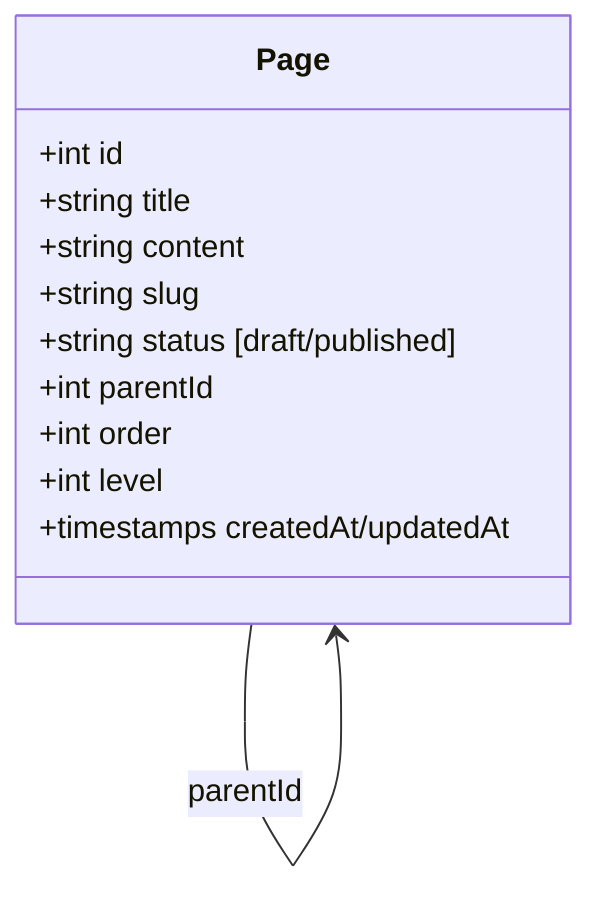
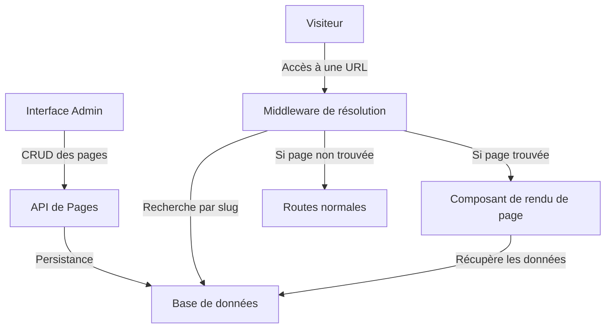

# Plan de mise en place de la gestion des pages

## Introduction

Ce document détaille le plan de mise en œuvre d'un système complet de gestion de pages pour l'application SMI Corporation. L'objectif est de créer un système qui permette de gérer les pages du site web avec les fonctionnalités suivantes :

- Stockage persistant en base de données
- URLs personnalisées (slugs)
- Structure hiérarchique (pages parent/enfant) limitée à 3 niveaux de profondeur
- Gestion des statuts (brouillon/publié)
- Interface d'administration conviviale

## 1. Modèle de données

### Création d'un modèle `Page` dans la base de données

Le modèle Page comprendra :

| Champ | Type | Description |
|-------|------|-------------|
| id | Integer | Identifiant unique |
| title | String | Titre de la page |
| content | Text | Contenu de la page (stocké en BBCode) |
| slug | String | URL personnalisée (format URL-friendly) |
| status | Enum | Statut de la page (brouillon/publié) |
| parentId | Integer | Référence à la page parente (NULL pour les pages racines) |
| order | Integer | Ordre d'affichage parmi les pages de même niveau |
| level | Integer | Niveau de profondeur dans la hiérarchie (0-2) |
| createdAt | DateTime | Date de création |
| updatedAt | DateTime | Date de dernière modification |

### Relations

- Une page peut avoir une page parente (relation avec elle-même via `parentId`)
- Une page peut avoir plusieurs pages enfants

## 2. API de gestion des pages

### 2.1 Modifications de l'API existante (`server/api/pages.js`)

L'API actuelle stocke les pages en mémoire. Il faut la modifier pour utiliser le modèle Sequelize et ajouter les fonctionnalités suivantes :

- Opérations CRUD complètes sur le modèle Page
- Validations pour tous les champs
- Génération automatique de slug à partir du titre
- Vérification de l'unicité des slugs
- Validation et maintien de la structure hiérarchique (max 3 niveaux)
- Gestion de l'ordre des pages

### 2.2 Nouvelles routes API

| Méthode | Route | Description |
|---------|-------|-------------|
| GET | /api/pages | Récupérer toutes les pages (avec pagination) |
| GET | /api/pages/published | Récupérer uniquement les pages publiées |
| GET | /api/pages/tree | Récupérer les pages sous forme d'arborescence |
| GET | /api/pages/by-slug/:slug | Récupérer une page par son slug |
| GET | /api/pages/:id | Récupérer une page par son ID |
| POST | /api/pages | Créer une nouvelle page |
| PUT | /api/pages/:id | Mettre à jour une page existante |
| PATCH | /api/pages/:id/status | Changer le statut d'une page |
| PATCH | /api/pages/:id/order | Modifier l'ordre d'une page |
| DELETE | /api/pages/:id | Supprimer une page |

## 3. Interface d'administration

### 3.1 Améliorations de l'interface existante (`app/pages/admin/pages.vue`)

L'interface d'administration actuelle doit être améliorée pour prendre en compte les nouveaux attributs :

- Ajout de champs pour le slug et le statut
- Prévisualisation du slug lors de la saisie du titre
- Ajout d'un indicateur visuel pour le statut de la page
- Interface pour définir la relation parent/enfant
- Validation côté client des contraintes (niveau hiérarchique, unicité du slug)

### 3.2 Nouvelle vue d'arborescence

Création d'une nouvelle vue pour visualiser et gérer l'arborescence des pages :

- Affichage des pages sous forme d'arbre hiérarchique
- Fonctionnalité de glisser-déposer pour réorganiser les pages
- Indicateurs visuels pour différencier les statuts (brouillon/publié)
- Actions rapides (publier/dépublier, supprimer)

## 4. Routage dynamique pour les pages publiques

### 4.1 Création d'un middleware de résolution de routes

Un middleware sera créé pour intercepter les requêtes et vérifier si elles correspondent à un slug de page :

- Recherche de la page par slug dans la base de données
- Si la page est trouvée et publiée, affichage du composant de rendu de page
- Sinon, continuation vers la route normale ou affichage d'une erreur 404

### 4.2 Composant de rendu de page

Un composant sera créé pour afficher le contenu d'une page :

- Rendu du contenu BBCode en HTML
- Gestion de la navigation pour les pages enfants
- Affichage des informations de la page (titre, date de mise à jour)

## 5. Étapes d'implémentation recommandées

1. Créer le modèle Page dans `server/models.js`
2. Modifier l'API existante pour utiliser le modèle Sequelize
3. Implémenter les nouvelles routes API
4. Mettre à jour l'interface d'administration existante
5. Créer la vue d'arborescence
6. Implémenter le middleware de résolution de routes
7. Créer le composant de rendu de page
8. Tester l'ensemble du système

## 6. Diagramme du flux de données

## Conclusion

Ce plan détaille les étapes nécessaires pour mettre en place un système complet de gestion de pages pour l'application SMI Corporation. Il offre une solution flexible et évolutive qui permettra de gérer efficacement le contenu du site.

Des fonctionnalités supplémentaires pourront être ajoutées ultérieurement, comme les métadonnées SEO ou des templates de page.